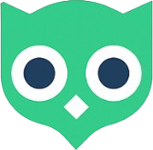

#  LateOwl — Client Application

[](https://nextjs.org/)
[](https://tanstack.com/query/latest)
[](https://tailwindcss.com/)

> ⚠️ **Looking for the Backend & Infrastructure?** The NestJS API, PostgreSQL, and Docker deployment files are located in the [Core Backend Repository](https://github.com/artsiom-andrasovich/backend-cotton).

LateOwl is a high-performance, responsive client application for a spaced repetition learning platform. Built with **Next.js 16 (App Router)** and **React 19**, it prioritizes a seamless user experience, complex state management, and an advanced editing interface.

> 🌐 **Live Application:** [lateowl.app](https://lateowl.app) > _(Test credentials: `test@lateowl.app` / `TestPassword123!`)_

---

## ✨ Key Frontend Features

- **Advanced Rich Text Editor:** Built entirely from scratch using Headless **TipTap**. Features include mathematical formula rendering (via `KaTeX`), code syntax highlighting (`lowlight`), and custom block extensions optimized for flashcard creation.
- **URL-Synchronized Filtering Engine:** A custom debounced hook system (`useQueryFilters`) that syncs complex UI states (categories, sorting) directly to the URL parameters (using `qs`) and `localStorage`. This ensures shareable links and persistent user sessions without unnecessary re-renders.
- **Complex Form Validation:** Robust client-side validation using `React Hook Form` combined with `Zod` schemas for real-time error handling.
- **Granular Customization:** Full Dark/Light mode support (`next-themes`) with custom CSS variables, and a bespoke **Icon Picker** combined with `react-colorful` for personalized deck covers.
- **Optimized Data Fetching:** Leveraging **TanStack React Query v5** for caching, optimistic UI updates, and background data synchronization with the NestJS backend.

## 🛠️ Tech Stack & Libraries

| Category               | Technologies / Packages                                                      |
| :--------------------- | :--------------------------------------------------------------------------- |
| **Core Framework**     | Next.js 16.1 (App Router, Turbopack), React 19.2                             |
| **State & Fetching**   | TanStack React Query v5, Axios                                               |
| **Styling & UI**       | Tailwind CSS v4, Radix UI (Headless), Lucide React, `clsx`, `tailwind-merge` |
| **Editor**             | TipTap Core & React, `katex`, `@aarkue/tiptap-math-extension`, `lowlight`    |
| **Forms & Validation** | React Hook Form, Zod, `@hookform/resolvers`                                  |
| **Utilities**          | `date-fns`, `qs`, `react-use` (useDebounce), `js-cookie`                     |

---

## ⚙️ Local Setup

1. **Clone the repository:**

   ```bash
   git clone [https://github.com/artsiom-andrasovich/frontend-cotton.git](https://github.com/artsiom-andrasovich/frontend-cotton.git)
   cd frontend-cotton
   ```

2. **Install dependencies:**
   This project uses Yarn.

```bash
yarn install
```

3. **Environment Configuration:**
   Create a .env.local file in the root directory and point it to your backend API:

```bash
NEXT_PUBLIC_API_URL=http://localhost:3000
```

4. **Run the development server:**
   The project is configured to use Turbopack on port `5555`.

```bash
yarn dev
```
